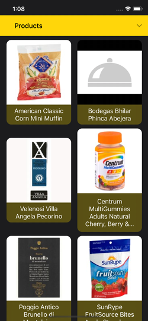
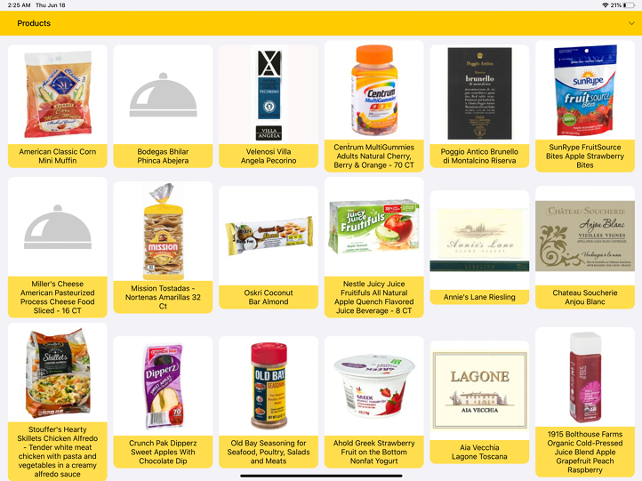

# Bekary
> Simple code sample for resume.

[![Swift Version][swift-image]][swift-url]
![license-image]

 

## Features

- [x] UICollectionView with auto-sizing cells and revealable sections
- [x] Adaptive UI for all iOS devices based on Trait Collections and Size Classes
- [x] Dark mode support
- [x] Elegant and simple animations
- [x] Other features under the hood(see tech stack or better - code)

## Tech stack

- [x] Clean Architecture
- [x] RxSwift
- [x] Network layer based on RxMoya+Alamofire 
- [x] Kingfisher for loading and caching images
- [x] Convenient pagination layer
- [x] Uses spoonacular JSON API as remote data source

## To be done

- [-] Add core data layer and auto-source-switching in pagination layer
- [-] Add detail view for product
- [-] Add DI
- [-] Find replacement for spoonacular API with Bakery items

## Requirements

- iOS 11.0+
- Xcode 11.5

## About

Author - Ardashes – focusedmind@yandex.com

Distributed under the MIT license.

[https://github.com/focusedmind/github-link](https://github.com/focusedmind/)

[swift-image]:https://img.shields.io/badge/swift-5.1-orange.svg
[swift-url]: https://swift.org/
[license-image]: https://img.shields.io/badge/License-MIT-blue.svg
